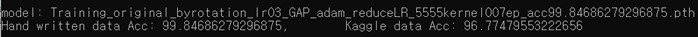
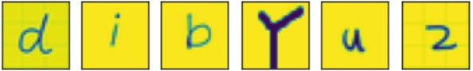
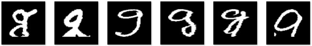

# MNISTClassification
-----
Classify hand written alphabet data with accuracy 99.x
  

## What is it?
Build a cnn model to classify handwritten alphabet lowercase characters.

## Branchs
- `matster`: develop env using jupyter-notebook
- `Python`: delvop env using Python file

## Dataset
- Train:Test = 5:1

- `Hand written datas`: In alpha_small directory
  - Generated by 20 peoples.
  - size= 28*28
  
- `Refined Kaggle dataset`: [From kaggle alphabet dataset](https://www.kaggle.com/sankalpsrivastava26/capital-alphabets-28x28)
  - Get from Kaggle dataset.
  - This data has so many faulty, Refine it one by one for validation folders
  - size= 300*300
  

